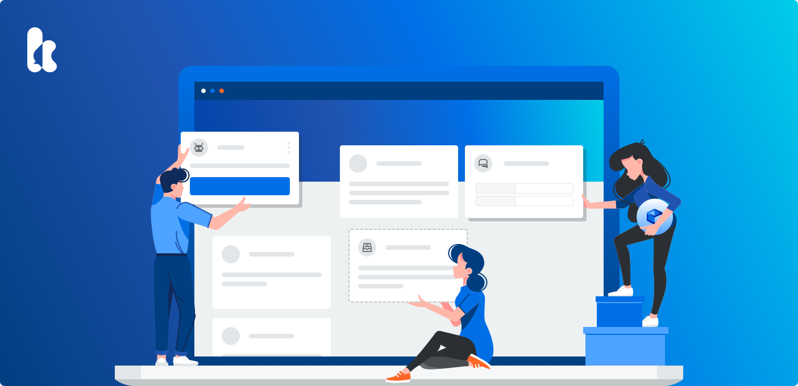

<text-primary>

The illustration is used in our Design Language System to tell the information of what/where users are and all the direction they could possibly go. It has to be meaningful and convey the ideas, while being considerate of the tasks that are accomplished, the context and sentiment.

To keep our brand look and feel as unified as possible, we attempt to embrace our illustrator’s personal touches and blend them into the Kata Illustration style. Some of the guidelines are very precise while some will leave it up to you as the illustrator to use your best decision to create a good illustration that supports our product.

</text-primary>

## When to Use

We use illustration in product and marketing purposes to support a clear, and consistent story from the beginning to the end. It is almost always used to support copy, and should never confuse the key message. Illustration commonly used in the following places:

- Platform App
- Websites
- Landing Pages
- Microsites
- Service Sites
- Presentations
- Posters
- Brochures
- Flyers
- Banner Ads
- Emails
- Social media
- Infographics
- Swag

## Palette Colors

The color palette used in the illustration consists of primary (brand) colors, additional brand colors, neutral colors, and secondary colors. And there are several linear gradients that we use also in the illustration. The color proportions are set in the Palette Partition guidelines.

### Primary (brand) colors

<foundation-color-swatch-grid>
  <foundation-color-swatch hexcode="#102a59" name="C03 - cobalt03" subtitle="Dark Cobalt"></foundation-color-swatch>
  <foundation-color-swatch hexcode="#2053af" name="C02 - cobalt02" subtitle="Cobalt"></foundation-color-swatch>
  <foundation-color-swatch hexcode="#5587e0" name="C01 - cobalt01" subtitle="Light Cobalt"></foundation-color-swatch>
</foundation-color-swatch-grid>

<foundation-color-swatch-grid>
  <foundation-color-swatch hexcode="#003e80" name="K03 - kata03" subtitle="Dark Kata"></foundation-color-swatch>
  <foundation-color-swatch hexcode="#006fe6" name="K02 - kata02" subtitle="Kata"></foundation-color-swatch>
  <foundation-color-swatch hexcode="#4da3ff" name="K01 - kata01" subtitle="Light Kata"></foundation-color-swatch>
</foundation-color-swatch-grid>

### Primary linear gradients

TODO

### Additional brand colors

<foundation-color-swatch-grid>
  <foundation-color-swatch hexcode="#00b2cb" name="B03 - belize03" subtitle="Teal"></foundation-color-swatch>
  <foundation-color-swatch hexcode="#00cce9" name="B02 - belize02" subtitle="Belize"></foundation-color-swatch>
  <foundation-color-swatch hexcode="#78e6ff" name="B01 - belize01" subtitle="Celeste"></foundation-color-swatch>
</foundation-color-swatch-grid>

### Additional brand gradients

[TODO: patterns]

### Neutral gradients

[TODO: patterns]

## Palette Partition

### Regular Pallete Partition

Regular palette partition is used to color kata.ai default illustrations. With strong accent colors and gradations construct the illustrations look and feel as unified with the brand.

[TODO: pallette partition]

### Positive Palette Partition

Positive palette partition is used to pronounce a positive information or action. By adding secondary colors (green) as an accent color of a positive state.

[TODO: pallette partition]

## Negative Palette Partition

Negative palette partition is used to pronounce a negative information or action. By adding secondary colors (re) as an accent color of a negative state.

[TODO: pallette partition]

## Type of Illustration

### Hero

Hero illustrations are designate to tell more complex information. This allows them to be more metaphorical and fancy in nature. The viewer gets the touch of collaboration, perform, achievement, and confidence. Hero illustrations contain more than 5 characters and/or things, and their complexity should vary depending on the expected size.

### Section

Section illustrations are slightly simplified versions of heroes, visually and metaphorically. These assets are perfect when you need to pack a punch with limited space. They are somewhat more literal representations of a single concept. Despite simplification, they still contain more than 1 characters and/or things.

### Spot

Spot illustrations are the convenient and most precise expression of a concept. Because they are often used in the product as an empty state, or in a composition with other spot illustrations, they are small and simple. Occasionally include some atmospheric background elements depending on the design.

## Best Practices

Use these basic design guidelines to create illustrations in product or marketing assets:

- **DO** use all illustrations at the recommended size.
- **DO** simplify your information and use plenty of white space around illustrations.
- **DON’T** make images disproportionately large to the rest of the content or use the image as a background element.
- **DO** use solid fill and/or linear gradients to coloring shapes and objects.
- **DO** use rounded corners.
- **DO** simplify silhouettes as much as possible.
- **DON’T** overcomplicate with unnecessary details.
- **DON’T** use radial gradients as they tend to make visual distortions.
- **DO** use strokes/outlines to define a shape. There are exceptions (ie. diagrams that require lines).
- **DO** use strokes/lines with rounded end caps and make sure the lines are not too skinny.
- **DO** use simple oval shape for a shadow in object or character.
